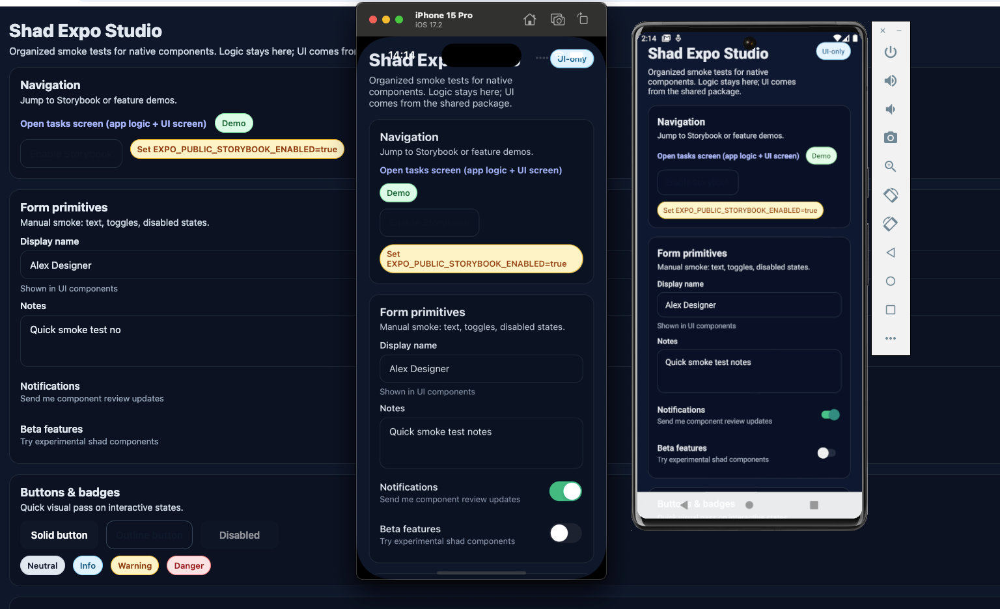
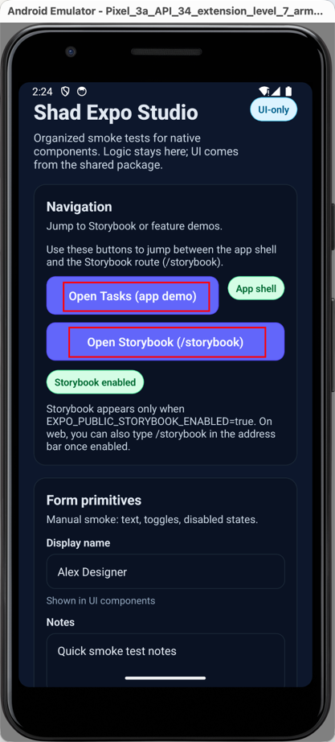
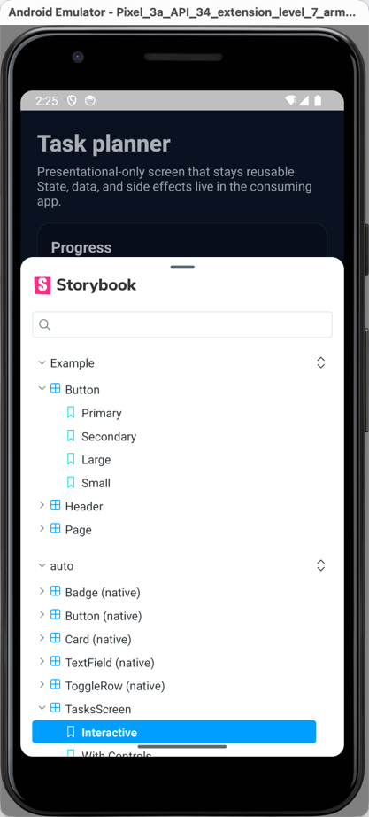

# shad-expo-studio
A studio for designing and shipping shadcn-style components in Expo/React Native with Storybook-backed visual regression.

## What this repo is for
- We’re in an AI-heavy era where code volume exploded and manual review misses subtle regressions. Visual regression + deterministic stories catch the flakiness and design drift that slip past PR review.
- Frontend teams are stretched between UI polish and business logic. By separating presentational UI (`packages/ui`) from product code (`apps/expo`), designers (or AI-assisted flows) can own the UI layer while app devs focus on data/flows.
- Cross-platform (native + web) Storybook coverage is still sparse in the community; this repo offers a concrete pattern for React Native Web + Expo with Chromatic baked in.
- We want a faster design-to-prod loop: examples drive generated stories, Chromatic locks visuals, and the app shell simply consumes the shared UI.
- The repo ships with lots of concrete code (components, screens, Storybook setup, scripts) so a coding agent—or anyone new—can follow the conventions and spin up new features or variants quickly without rediscovering patterns.

## How to use it (in short)
- Install deps (below), then run `pnpm start:storybook` to regenerate stories and open the Storybook-enabled Expo bundle.
- Edit or add `*.examples.tsx` next to components in `packages/ui/src/native/**` to drive Storybook; rerun `pnpm start:storybook` (or `pnpm --filter expo-app storybook:generate:auto`) to regenerate.
- For visual regression, add `CHROMATIC_PROJECT_TOKEN` to `apps/expo/.env.local` and run `pnpm chromatic` to upload the web Storybook build.

## Getting started

### Setting up the repo
```bash
corepack enable                       # let Corepack manage the pnpm shim
corepack install                      # install the pinned pnpm version from package.json
pnpm install                          # install all workspace deps (preinstall will verify Node/pnpm versions)
pnpm dlx husky                        # install git hooks (pre-commit runs pnpm format:fix; pre-push runs pnpm typecheck && pnpm lint:fix)
```

### Setting up Expo
1. Follow the instrcution in [expo doc](https://docs.expo.dev/get-started/set-up-your-environment) of:  
- choose android emulator and ios simulator respectively 
- choose development build
- choose to not using Expo Application Services (EAS)
- Do not run the local commands in the webpage


2. Follow [this doc](https://github.com/expo/fyi/blob/main/setup-xcode-signing.md) to setup ios


3. Execute these commands
```bash
cd apps/expo
pnpm storybook:generate:auto && pnpm storybook-generate # Generate the required files for Storybook
pnpm web                              # start the web dev server to confirm the toolchain
npx expo install expo-dev-client      # install native dev client deps for iOS/Android
pnpm android                          # build and launch the Android dev client in the emulator
pnpm ios                              # build and launch the iOS dev client in the simulator
```

## Daily commands

### common scripts 
```bash
pnpm dev                            # run turbo dev across packages in parallel
pnpm ios                            # run expo-app iOS dev build from the repo root
pnpm android                        # run expo-app Android dev build from the repo root
pnpm web                            # run expo-app web dev server from the repo root
pnpm --filter expo-app start        # start Expo bundler and choose ios/android/web in the prompt
pnpm format:fix                     # auto-format sources via Prettier across packages
pnpm lint:fix                       # auto-fix lint issues across packages
pnpm lint && pnpm typecheck         # run eslint + typescript checks
pnpm test                           # run Jest (set WATCHMAN_DISABLE=1 if watchman is unavailable)
```

### Storybook
- Native/on-device (Expo bundler, also works for web if you choose the web target): `pnpm start:storybook`, then open the `/storybook` route in the app (Expo Router). Use `pnpm web:pure` to run a pure app web bundle, or `pnpm web:storybook` to include Storybook in the web bundle explicitly.
- Web (browser UI via Vite/React Native Web): `pnpm storybook` from the repo root (opens on port 6006).

### Switching between app shell and Storybook
- Pure app shell: run `pnpm web:pure` (or `pnpm --filter expo-app start` without setting `EXPO_PUBLIC_STORYBOOK_ENABLED`) to load only the app screens.
- Storybook-enabled bundle: run `pnpm start:storybook` (native or web target) or `pnpm web:storybook` for web-only. Both set `EXPO_PUBLIC_STORYBOOK_ENABLED=true` before starting the Expo bundler.
- In the running app, tap the `Open Storybook (/storybook)` button on the home screen Navigation card or in the Tasks screen header. You can also type `/storybook` in the app URL once the Storybook bundle is enabled.
- Switch modes by restarting the bundler with or without `EXPO_PUBLIC_STORYBOOK_ENABLED`; the Storybook button hides itself when the bundle is pure app-only, so you can confirm the mode visually.

### Visual guide
- Cross-platform view (web + iOS + Android) with Storybook toggle visible:

  

- Home shell with jump buttons (tap `Open Storybook (/storybook)` to switch):

  

- Storybook running at `/storybook` after enabling `EXPO_PUBLIC_STORYBOOK_ENABLED=true`:

  

- Tasks screen with the same Storybook jump in the header:

  

## Development flow (recommended)
- Build presentational UI in `packages/ui` only (no router/hooks/network/state there). Keep business logic, data, navigation, and side-effects in `apps/expo` route wrappers.
- For each component/screen, add a `*.examples.tsx` next to it exporting `storyMeta` + `storyExamples` (deterministic data, no side-effects).
- Run `pnpm start:storybook` (root). It regenerates stories and Storybook requires files automatically, then starts Expo with Storybook enabled. Inspect `/storybook` on device/web for quick visual checks.
- Husky hooks already help:
  - pre-commit: runs `pnpm --filter expo-app storybook:generate:auto` + `pnpm format:fix`
  - pre-push: runs `pnpm typecheck` + `pnpm lint:fix`
- Manual: run `pnpm lint && pnpm typecheck` if you skip hooks or want to check early; `pnpm format:fix` cleans up formatting.

## Design philosophy & tooling
- Separation of concerns: `packages/ui` = presentational React Native UI only; `apps/expo/app/*` = Expo Router shells that own state, data fetching, navigation, analytics, and pass props down.
- UI-first: prioritize stable, deterministic examples for visual regression. Avoid backend SDKs or product-specific logic in the UI package.
- Storybook auto-gen: examples drive generated stories under `apps/expo/.rnstorybook/stories/auto/**`. Do not edit generated files; change examples and rerun `pnpm start:storybook`.
- Chromatic: CI publishes the web Storybook to Chromatic for visual diffs; keep examples deterministic to make snapshots reliable.

## Chromatic (visual regression)
- We use Chromatic to publish the web Storybook. CI runs `pnpm chromatic` (which calls the `apps/expo` Chromatic script) on in-repo PRs.
- Setup for contributors:
  - Local: put `CHROMATIC_PROJECT_TOKEN=...` in `apps/expo/.env.local` (gitignored). The `pnpm chromatic` script auto-loads `.env.local`/`.env` and passes the token through.
  - CI: store the same token in your CI secrets as `CHROMATIC_PROJECT_TOKEN`.
- Run locally from repo root: `pnpm chromatic`. This builds the React Native Web Storybook and uploads snapshots to Chromatic’s CDN using the token from `.env.local`/`.env`.
