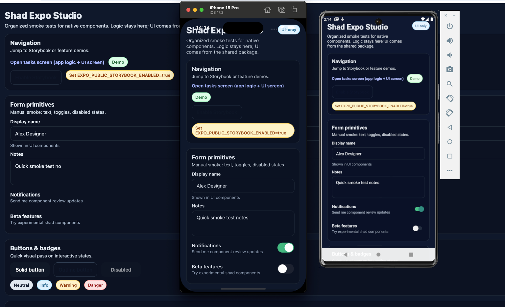

# Shad Expo Studio

**A visual-regression studio for Expo / React Native UI components. Not a component library.**

Every component in this repo ships with a deterministic example file that generates its Storybook story and its Chromatic visual baseline. One component tree renders on iOS, Android, and Web; visual regression runs on the web render.

[](https://github.com/Ge-limin/shad-expo-studio/actions/workflows/ci.yml)
[](LICENSE)
[](https://storybook.js.org)
[](https://expo.dev)



The name, decoded: **shad** = shadcn-style (you own the component source), **expo** = the platform, **studio** = the authoring and visual-regression harness around it.

## Try it

**Run the Storybook locally — no Xcode, no emulator, no signing:**

```bash
pnpm install
pnpm preview        # Storybook opens at http://localhost:6006
```

That's the whole setup for browsing components. Full native builds (iOS simulator / Android emulator) are only needed when you develop the app shell itself — see [Full native development](#full-native-development) below.

## Who this is for

You're building a real Expo app, probably with AI coding agents in the loop. You own your component layer and you want proof — a story and a visual baseline per component — that a change didn't silently break your UI on the way to production.

Who it's **not** for:

- If you want a drop-in component library with dozens of ready components, use [react-native-reusables](https://github.com/founded-labs/react-native-reusables). It's excellent and that's its job.
- If you're a large design-system org that needs breadth, theming infrastructure, and support — this is a solo-maintained reference setup, not that.

## How this compares

react-native-reusables, gluestack-ui, and Tamagui give you components. This repo gives components a **workflow**: a deterministic example, a generated Storybook story, a Chromatic baseline, and CI that runs typecheck/lint/test on every PR. They're complementary — you can bring their components into this studio and put them under the same visual-regression harness.

The examples files serve double duty: each `*.examples.tsx` is at once a Storybook story source and a machine-readable usage example a coding agent can consume. shadcn's ecosystem moved in this direction on the web in 2026 (MCP, llms.txt); on React Native this workflow is still rare.

## How it works

```
packages/ui/src/native/common/button.tsx            ← the component (plain StyleSheet, no styling deps)
packages/ui/src/native/common/button.examples.tsx   ← deterministic examples: storyMeta + storyExamples
        │
        │  pre-commit hook (or: pnpm --filter expo-app storybook:generate:auto)
        ▼
apps/expo/.rnstorybook/stories/auto/common/button.examples.stories.tsx   ← generated, do not edit
        │
        ├── web Storybook (Vite + React Native Web) → Chromatic visual baseline
        └── on-device Storybook (/storybook route in the Expo app)
```

1. Write a presentational component in `packages/ui/src/native/` — no hooks into navigation, network, or app state.
2. Add a `*.examples.tsx` next to it exporting `storyMeta` + `storyExamples` with deterministic data. Copy an existing one (e.g. `button.examples.tsx`) as the template.
3. Commit. The pre-commit hook regenerates stories and formats; CI typechecks, lints, and tests; Chromatic diffs the web Storybook against the locked baselines.
4. The app shell (`apps/expo`) imports the same components, so what Storybook verifies is what ships.

## What's inside

The inventory is deliberately small. Every entry is fully wired — example, story, baseline — because adding a component here means adding all three, and the tooling generates two of them for you.

| Component | Source | Example | Story | Visual baseline |
| --- | --- | --- | --- | --- |
| Badge | `common/badge.tsx` | ✓ | ✓ | ✓ |
| Button | `common/button.tsx` | ✓ | ✓ | ✓ |
| Card | `common/card.tsx` | ✓ | ✓ | ✓ |
| TextField | `common/text-field.tsx` | ✓ | ✓ | ✓ |
| ToggleRow | `common/toggle-row.tsx` | ✓ | ✓ | ✓ |
| Tasks screen | `screen/tasks.tsx` | ✓ | ✓ | ✓ |

Components use plain React Native `StyleSheet` — no NativeWind, no Tailwind config to wire up before they render.

## Install components into your own app

The components are distributed as source through a shadcn-compatible registry — you copy the code and own it, nothing to `npm install`. From your Expo project:

```bash
npx shadcn@latest add https://raw.githubusercontent.com/Ge-limin/shad-expo-studio/main/public/r/button.json
```

Available items: `badge`, `button`, `card`, `text-field`, `toggle-row`, and `tasks-screen` (which pulls its four component dependencies automatically). Files land under `components/studio/` in your project.

One caveat: the shadcn CLI doesn't detect Expo as a framework, so it needs a `components.json` in your project root. If you don't have one, create this minimal version first:

```json
{
  "$schema": "https://ui.shadcn.com/schema.json",
  "style": "new-york",
  "rsc": false,
  "tsx": true,
  "tailwind": { "config": "", "css": "", "baseColor": "neutral", "cssVariables": false },
  "aliases": { "components": "@/components", "ui": "@/components/ui", "lib": "@/lib", "utils": "@/lib/utils", "hooks": "@/hooks" }
}
```

The tailwind/aliases fields are required by the schema but unused here — every registry item declares an explicit `target` path and has zero styling dependencies.

CI rebuilds the registry on every PR and fails if `public/r/` is out of sync with the component sources, so what you install always matches what Storybook and Chromatic verified.

## Daily commands

```bash
pnpm preview                        # web Storybook at :6006 (regenerates stories first)
pnpm web                            # run the app shell in the browser
pnpm start:storybook                # Expo bundler with the on-device /storybook route enabled
pnpm lint && pnpm typecheck         # eslint + typescript checks
pnpm test                           # Jest (set WATCHMAN_DISABLE=1 if watchman is unavailable)
pnpm format:fix                     # Prettier across packages
pnpm chromatic                      # build web Storybook and upload snapshots to Chromatic
```

Husky hooks do the routine work: pre-commit regenerates stories + formats, pre-push runs typecheck + lint.

### Switching between app shell and Storybook

- `pnpm web` loads only the app screens.
- `pnpm start:storybook` (native or web) or `pnpm web:storybook` (web only) sets `EXPO_PUBLIC_STORYBOOK_ENABLED=true` and exposes the `/storybook` route, plus an `Open Storybook` button on the home screen and Tasks header. The button hides itself in pure app mode, so you can confirm the mode visually.

## Visual regression with Chromatic

CI publishes the web Storybook to Chromatic for visual diffs on in-repo PRs. Keep examples deterministic — no random data, no dates from the clock — so snapshots are stable.

To run it yourself:

1. Put `CHROMATIC_PROJECT_TOKEN=...` in `apps/expo/.env.local` (gitignored).
2. `pnpm chromatic` from the repo root. It builds the React Native Web Storybook and uploads snapshots.

## Full native development

<details>
<summary>iOS / Android dev builds (only needed for app-shell work, not for component browsing)</summary>

1. Follow the [Expo environment setup](https://docs.expo.dev/get-started/set-up-your-environment) for iOS simulator and Android emulator, choosing **development build** without EAS. Don't run the local commands on that page.
2. For iOS signing, follow [setup-xcode-signing](https://github.com/expo/fyi/blob/main/setup-xcode-signing.md).
3. Then:

```bash
cd apps/expo
pnpm storybook:generate:auto && pnpm storybook-generate   # regenerate story files
npx expo install expo-dev-client                          # native dev client deps
pnpm android                                              # build + launch Android dev client
pnpm ios                                                  # build + launch iOS dev client
```

The repo pins Node ≥ 20.10 and pnpm 10.17.1 (`packageManager` field — corepack picks it up automatically; `pnpm install` also installs the git hooks).

</details>

## Monorepo structure

```
apps/expo/       Expo Router app shell: routes, state, data, navigation. Storybook config + generated stories.
packages/ui/     Presentational components only + their *.examples.tsx. No router/network/app state.
tooling/         Shared eslint / prettier / tsconfig.
```

The split is the point: the UI package stays pure and deterministic so stories and baselines stay reliable, while everything stateful lives in route wrappers under `apps/expo/app/`.

## Contributing

The contribution unit is a component plus its examples file — see [CONTRIBUTING.md](CONTRIBUTING.md) for the full authoring loop.

## Why this exists

Code volume exploded in the AI-assisted era and manual review misses subtle visual regressions. Deterministic stories plus Chromatic baselines catch the drift that slips past PR review. Separating presentational UI from product code lets a designer, or an AI agent, own the UI layer while app code stays focused on data and flows. And cross-platform Storybook coverage for React Native is still painful to wire up from scratch — this repo is that wiring, done once, as a working reference.

## License

[MIT](LICENSE)
